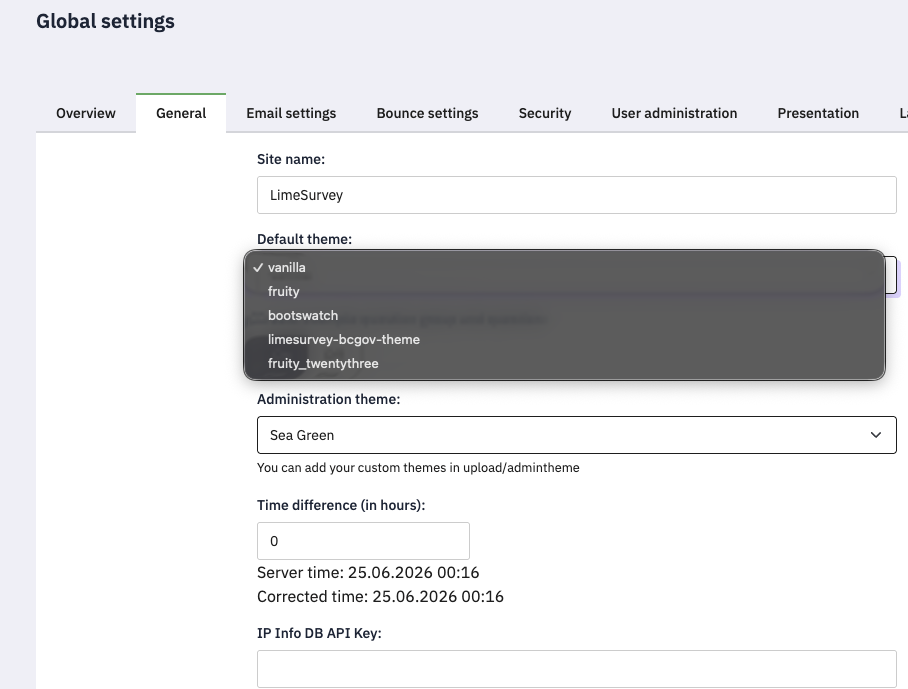
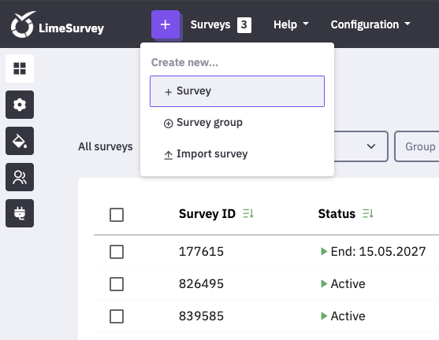
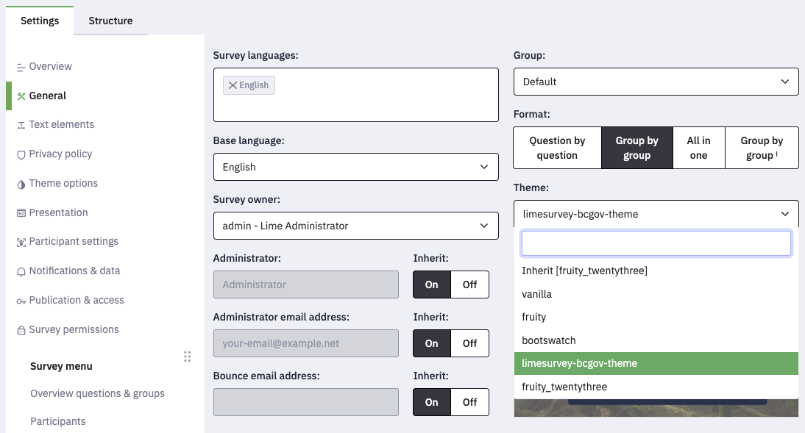
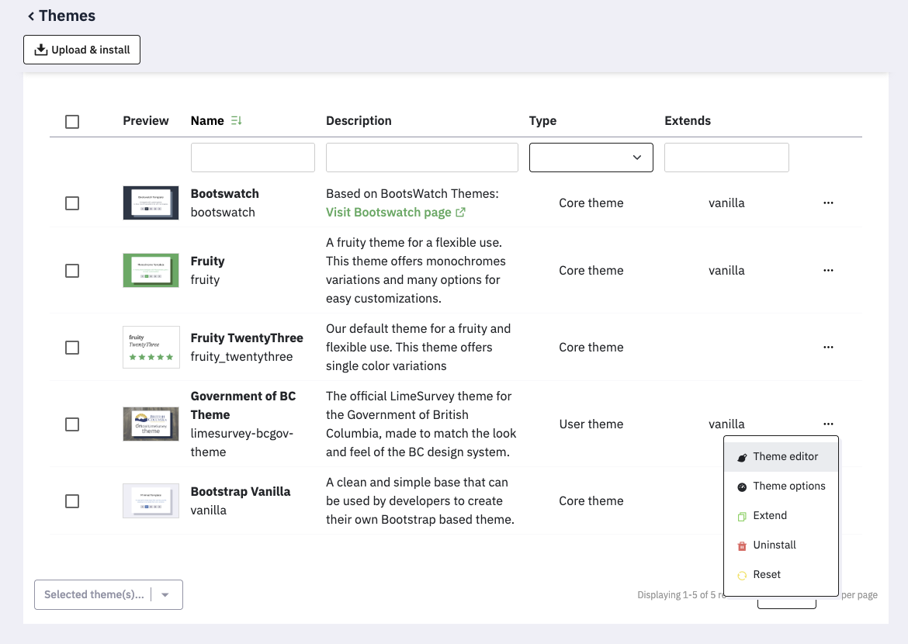

# Government of British Columbia LimeSurvey Theme

- **License:** GNU General Public License version 2
- **Version:** 1.0.0
- **Author:** Jareth Whitney

The LimeSurvey theme for the Government of British Columbia, made to match the look and feel of the BC Design System.
<br />

## Contents

- [User Installation](#user-installation)
- [Development Prerequisites](#development-prerequisites)
- [Development Installation](#development-installation)
- [Configuration](#configuration)
- [Contributing](#contributing)
- [License](#license)
- [Contact](#contact)
<br />

## User Installation

Do not install the theme from this repo. Instead:
<br />

1. Download the `.zip` distribution of the theme  
2. Navigate to the **Themes** section of the LimeSurvey dashboard  
3. Click **Upload and Install**
<br />

## Development Prerequisites

- [LimeSurvey](https://community.limesurvey.org/downloads/) (v7.0.0+)  
- [Docker Desktop](https://docker.com) (v4.79.0+)  
  - Alternatively:  
    - [Podman Desktop](https://podman-desktop.io/downloads) (v1.24.0+)  
    - [Rancher Desktop](https://rancherdesktop.io/) (v1.22.3+)
<br />

## Development Installation

Step-by-step instructions to get your local development environment running.
<br />

### 1. Stand up a LimeSurvey instance

Create a `docker-compose.yaml` file:
<br />

```yml
services:
  limesurvey:
    image: acspri/limesurvey:7.0.0
    ports:
      - "8080:80"
    environment:
      LIMESURVEY_INSTALL: "true"
      LIMESURVEY_DB_HOST: mysql
      LIMESURVEY_DB_NAME: limesurvey
      LIMESURVEY_DB_USER: limesurvey
      LIMESURVEY_DB_PASSWORD: limesurvey
      LIMESURVEY_ADMIN_USER: "USERNAME HERE"
      LIMESURVEY_ADMIN_PASSWORD: "PASSWORD HERE"
      LIMESURVEY_ADMIN_EMAIL: "EMAIL HERE"
      LIMESURVEY_DEFAULT_LANGUAGE: en
    depends_on:
      - mysql
    volumes:
      - limesurvey-config:/var/www/html/application/config
      - ./uploads:/var/www/html/upload

  mysql:
    image: mariadb:10.11
    environment:
      MYSQL_DATABASE: limesurvey
      MYSQL_USER: limesurvey
      MYSQL_PASSWORD: limesurvey
      MYSQL_ROOT_PASSWORD: root
    volumes:s
      - mysql-data:/var/lib/mysql

volumes:
  limesurvey-config:
  mysql-data:
```
<br />

### 2. Clone the theme repository

```bash
cd <LimeSurvey directory>/uploads/themes/survey
git clone https://github.com/bcgov/limesurvey-bcgov-theme.git
cd limesurvey-bcgov-theme
```
<br />

### 3. (Optional) Set as global default theme

If you intend to use this theme for all surveys:

- Go to **Global Settings → General**
- Select the theme from the dropdown


<br />

### 4. (Optional) Create a test survey

Create a test survey to safely test theme changes.


<br />

### 5. (Optional) Apply theme to a survey

- Go to **Survey Settings → General → Theme**
- Select the theme


<br />

### 6. Edit the theme in LimeSurvey

- Navigate to **Themes**
- Click the **three dots (⋯)** next to the theme
- Select **Theme Editor**


<br />

## Configuration

Theme options are available in the LimeSurvey dashboard:

1. Go to **Themes**
2. Click the **three dots (⋯)** beside the theme
3. Select **Theme Options**

> Note: Image and font customization may be limited. The theme is designed to use:
> - Government of British Columbia logo
> - BC Sans 2.0 font
<br />

## Contributing

We welcome contributions!

1. Fork the repository  
2. Create your feature branch  
   ```bash
   git checkout -b feature/AmazingFeature
   ```
3. Commit your changes  
   ```bash
   git commit -m "Add some amazing feature"
   ```
4. Push to the branch  
   ```bash
   git push origin feature/AmazingFeature
   ```
5. Open a pull request  
<br />

Ensure your code follows the existing style guidelines, as defined in the [BC Design System](https://www2.gov.bc.ca/gov/content/digital/design-system).
<br />

## License

This theme is distributed under the [GNU General Public License version 2](https://www.gnu.org/licenses/old-licenses/gpl-2.0.html).
<br />

## Contact

- **Project Maintainer:** Jareth Whitney  
- **Email:** jareth.whitney@gov.bc.ca  
- **Project:** https://github.com/bcgov/limesurvey-bcgov-theme
